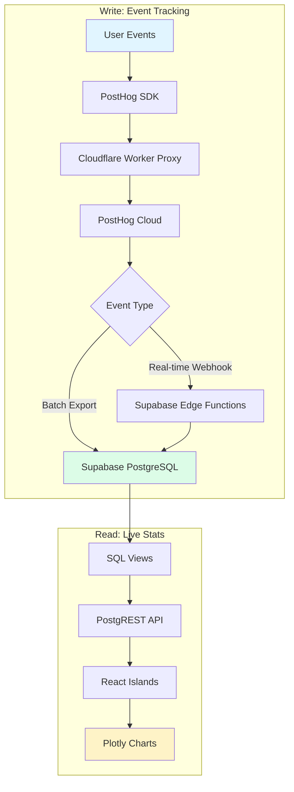

# eeshans.com — Collection of interactive data science web apps + portfolio

> "The best way to understand data is to build the system that creates it."

**Live:** [eeshans.com](https://eeshans.com)

**Want to contribute?** → [eeshans.com/contribute](https://eeshans.com/contribute)

---

## What This Is

A full-stack data science portfolio built in public. Each project is a complete product with real users, production analytics, and published analysis.

**Not** a tutorial site or course platform. Just one person building, documenting, and learning in public, using AI tools to create functional products, deploying to production, and analyzing real behavior.

---


## Current Projects

### A/B Testing Memory Game
Interactive memory game with real A/B testing, live stats, and full analysis pipeline. 

**Stack:** Astro + React + PostHog + Supabase + Plotly

[→ Try it live](https://eeshans.com/ab-simulator) | [→ Read the analysis](https://eeshans.com/projects/ab-simulator) | [→ View source](https://github.com/eeshansrivastava89/datascienceapps/tree/main/packages/ab-simulator)

---

## Tech Stack

| Layer | Technology | Purpose |
|-------|-----------|---------|
| Framework | Astro 4.x | Static-first, React islands for interactivity |
| Styling | Tailwind CSS | Utility-first, dark mode, responsive |
| Interactivity | React 19 | Stats dashboards, game logic, comments |
| Analytics | PostHog | Event tracking, feature flags, session replay |
| Database | Supabase | PostgreSQL + PostgREST + edge functions |
| Hosting | Fly.io | Docker deployment, global CDN |
| Monorepo | pnpm workspaces | Shared components across packages |

---

## Analytics Pipeline



**Main site**: Batch export (1 hour intervals) for pageviews and blog analytics  
**AB Simulator**: Real-time webhooks for immediate game stats updates

---

## Deployment

**Automated via GitHub Actions:**
- **Fly.io deployment** — Pushes to `main` trigger Docker build and deploy
- **Notebook publishing** — Weekly cron job executes Jupyter notebooks, renders to HTML, commits to repo

All analytics keys and environment variables managed via GitHub Secrets and Fly.io secrets.

---

## Architecture

```
datascienceapps/
├── src/                    # Main portfolio site
│   ├── pages/             # Home, About, Projects, Writing, Contribute
│   ├── content/post/      # MDX blog posts
│   └── components/        # Site-specific components
├── packages/
│   ├── ab-simulator/      # Standalone A/B testing game
│   └── shared/            # Shared components, layouts, project configs
├── analytics/notebooks/   # Jupyter analysis (auto-published to HTML)
└── public/                # Static assets
```

**Convention:**
- Hub pages: `/projects/{id}` (analysis, notebooks, posts)
- Apps: `/{id}/` (actual interactive product)

See [ARCHITECTURE.md](docs/ARCHITECTURE.md) for full technical details.

---

## Contributing

Want to build with me? See the full guide at **[eeshans.com/contribute](https://eeshans.com/contribute)**

Quick paths:
- **Fix or enhance** — Browse [open issues](https://github.com/eeshansrivastava89/datascienceapps/issues), claim one, submit PR
- **Build new app** — Propose via [GitHub Discussion](https://github.com/eeshansrivastava89/datascienceapps/discussions/new?category=new-data-science-web-app-proposals), use `create-package` script

Setup: Clone repo, copy `.env.example` to `.env`, run `pnpm install && pnpm dev`

---

## License

MIT © 2025 Eeshan Srivastava

Built with [Astro Theme Resume](https://github.com/srleom/astro-theme-resume) (MIT)
